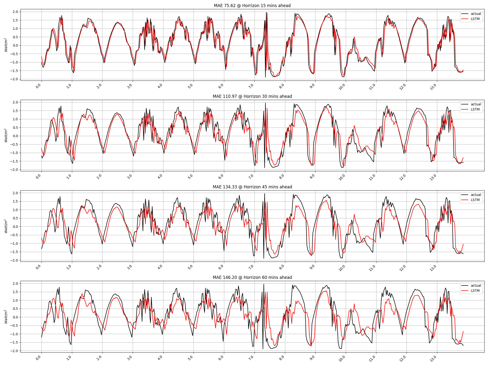

# Quick start

1. Put your data into 'dataset/CUEE_PMAS' ... That is ... 
  - 'dataset/CUEE_PMAS/pmaps_test_data.csv'
  - 'dataset/CUEE_PMAS/pmaps_train_data.csv'

2. Run a script to train a model in 'cuee_scripts/Long-Exp' folder. For example,

```
./cuee_scripts/Long-Exp/LSTM-CUEE_Train_Pred1.sh
```


- The results of the training will be saved in 
  - `checkpoints` folder. For example, ...
    `./checkpoints/CUEEData_24_4_DLinear_CUEE_mv37_.../checkpoint.pth` which is the trained weights.
  - Note that you still need to customize the model parameters, as these parameters are set as an example. They may not be the best   set of parameters for your cases.

3. Then, you may run another script to get the following plot:

```
./cuee_scripts/Long-Exp/LSTM-CUEE_Infer_Pred1.sh
```

Here, we have a mode to run validation or testing... 
If you set `mode=val`, then it will run inference on the validation set.
On the other hand, if you set  `mode=test`, then it will run inference on the test set.


```
feature_type=MS 
num_features=7 

model_name=RLSTM 
mode=val # test or val 

for d_model in 8 16 32 64 128
do
python -u plot_longExp.py \
    --mode $mode \
    --root_path ./dataset/CUEE_PMAS/ \
    --test_data_path pmaps_test_data.csv \
    --train_data_path pmaps_train_data.csv \
    --model_id CUEE_PMAS_$seq_len'_'$pred_len \
    --model $model_name \
    --moving_avg $moving_avg \
    --data CUEE_PMAS \
    --features $feature_type \
    --target $target \
    --seq_len $seq_len \
    --label_len $label_len\
    --pred_len $pred_len \
    --d_model $d_model \
    --enc_in $num_features \
    --dec_in $num_features \
    --c_out  $num_features \
    --des 'Exp' \
    --batch_size $batch_size --learning_rate 0.0001 --itr 1  
done
```


  - The results of the training will be saved in 
    - `valids` folder. For example, ...
      `./valids/CUEE_PMAS_37_1_Informer_CUEE_PMAS_mv4_ftMS_btch64_sl37_ll0_pl1_dm8_nh8_el2_dl1_df2048_fc3_ebtimeF_dtTrue_Exp_0` containing the plots and stats of the algorithm performance.

    - `results` folder. For example, ...
      `./results/CUEE_PMAS_37_1_Informer_CUEE_PMAS_mv4_ftMS_btch64_sl37_ll0_pl1_dm8_nh8_el2_dl1_df2048_fc3_ebtimeF_dtTrue_Exp_0` containing the plots and stats of the algorithm performance.

    - `checkpoints` folder. For example, ...
      `./checkpoints/CUEE_PMAS_37_1_Informer_CUEE_PMAS_mv4_ftMS_btch64_sl37_ll0_pl1_dm8_nh8_el2_dl1_df2048_fc3_ebtimeF_dtTrue_Exp_0` containing the weights


4. After running inference on the validation set, then you can run 

```
python  plot_validation.py

```

Here, you may change the setting on the top of the files to make sure that the folder name in `folder_list` match the folder that store the saved checkpoints and validation results ...

```
import os
import csv
import pdb

dataset = "CUEE_PMAS"
main_folder_path = "checkpoints"
val_folder_path  = "valids"
model_name = "RLSTM" #"Informer"
seq_length = 37
pred_length = 1
mode = "MS"
batch_size = 64
moving_average  = 4
fc = 1 # 3

folder_list = [
    "%s_%d_%d_%s_%s_mv%d_ft%s_btch%d_sl%d_ll0_pl%d_dm8_nh8_el2_dl1_df2048_fc%d_ebtimeF_dtTrue_Exp_0"   % (dataset, seq_length, pred_length, model_name, dataset, moving_average, mode, batch_size, seq_length, pred_length, fc),
    "%s_%d_%d_%s_%s_mv%d_ft%s_btch%d_sl%d_ll0_pl%d_dm16_nh8_el2_dl1_df2048_fc%d_ebtimeF_dtTrue_Exp_0"  % (dataset, seq_length, pred_length, model_name, dataset, moving_average, mode, batch_size, seq_length, pred_length, fc),
    "%s_%d_%d_%s_%s_mv%d_ft%s_btch%d_sl%d_ll0_pl%d_dm32_nh8_el2_dl1_df2048_fc%d_ebtimeF_dtTrue_Exp_0"  % (dataset, seq_length, pred_length, model_name, dataset, moving_average, mode, batch_size, seq_length, pred_length, fc), 
    "%s_%d_%d_%s_%s_mv%d_ft%s_btch%d_sl%d_ll0_pl%d_dm64_nh8_el2_dl1_df2048_fc%d_ebtimeF_dtTrue_Exp_0"  % (dataset, seq_length, pred_length, model_name, dataset, moving_average, mode, batch_size, seq_length, pred_length, fc),
    "%s_%d_%d_%s_%s_mv%d_ft%s_btch%d_sl%d_ll0_pl%d_dm128_nh8_el2_dl1_df2048_fc%d_ebtimeF_dtTrue_Exp_0" % (dataset, seq_length, pred_length, model_name, dataset, moving_average,  mode,batch_size,  seq_length, pred_length, fc), 
]

```
This will result in a figure containing the validation:

  - RLSTM
  

  - Informer
  
  
5. Example outputs 


  - Output in `valids` folder: 
 
  
