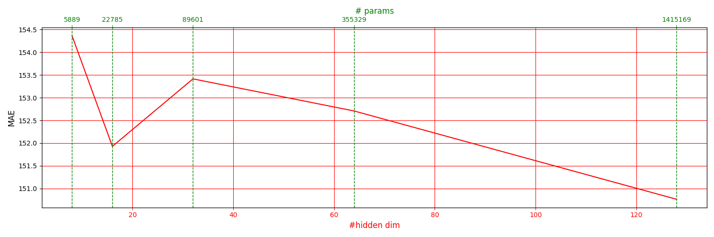
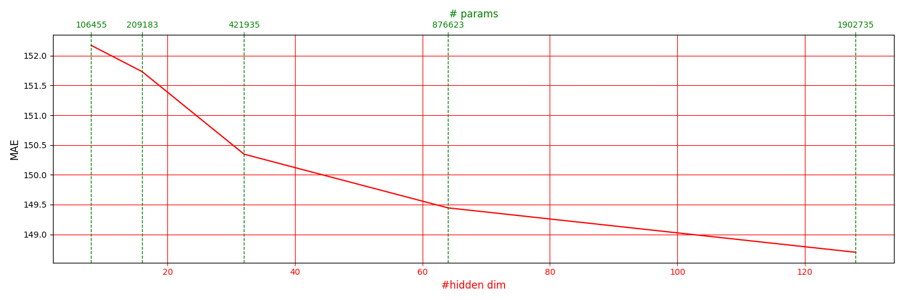
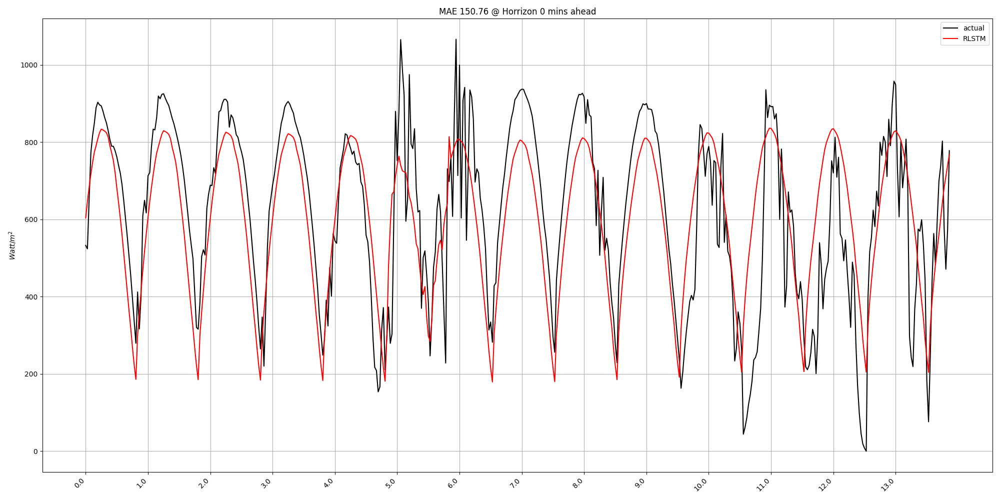

# Quick start

## Install dependencies

Create a new anaconda environment

```
conda create -n "TimeSeries312" python==3.12
```

Then, install Pytorch

```
pip3 install torch torchvision torchaudio
```

and install other packages

```
pip install -r "requirements.txt"
```

## Data generation 

1. Put your csv data into 'dataset/CUEE_PMAPS_NIGHT' ... For example ... 

  - 'dataset/CUEE_PMAPS_NIGHT/pmaps_test_with_nighttime.csv'
  - 'dataset/CUEE_PMAPS_NIGHT/pmaps_train_with_nighttime.csv'
  - 'dataset/CUEE_PMAPS_NIGHT/pmaps_validate_with_nighttime.csv'

2. Run the scrip to generate the data

  ```
  ./cuee_scripts/Data_generation.sh
  ```

3. You can check if the data is generated properly by running the following python file:

```
python check_input_data.py
```

You should get a result that look something like:


## Start running 

1. Run a script to train a model in 'cuee_scripts/Long-Exp' folder. For example,

    ```
    ./cuee_scripts/Long-Exp/LSTM-CUEE_Train_Pred1.sh
    ```

    The results of the training will be saved in 

      - `checkpoints` folder. For example, ...
        `./checkpoints/CUEEData.../checkpoint.pth` which is the trained weights.

      - Note that you still need to customize the model parameters, as these parameters are set as an example. They may not be the best   set of parameters for your cases.

      - The performance on training, testing and validation sets are provided on `./checkpoints/CUEEData.../stats_mae_mse.csv` ... So, that you have some ideas of how things are... 

2. Then, you may run another script to get the following plot:

    ```
    ./cuee_scripts/Long-Exp/LSTM-CUEE_Infer_Pred1_valid_mode.sh
    ```

    Here, we have a mode to run validation or testing... 
    If you set `mode=val`, then it will run inference on the validation set.
    On the other hand, if you set  `mode=test`, then it will run inference on the test set.


    ```
    feature_type=MS 
    num_features=7 

    model_name=RLSTM 
    mode=val # test or val 

    for d_model in 8 16 32 64 128
    do
    python -u infer_longExp.py \
        --mode $mode \
        --root_path ./dataset/CUEE_PMAPS_NIGHT/ \
        --test_data_path pmaps_test_with_nighttime.csv \
        --valid_data_path pmaps_validate_with_nighttime.csv \
        --train_data_path pmaps_train_with_nighttime.csv \
        --model_id CUEE_PMAPS_NIGHT_$seq_len'_'$pred_len \
        --model $model_name \
        --moving_avg $moving_avg \
        --data CUEE_PMAPS_NIGHT \
        --features  $feature_type \
        --target    $target \
        --seq_len   $seq_len \
        --label_len $label_len\
        --pred_len $pred_len \
        --d_model  $d_model \
        --e_layers $e_layer \
        --enc_in $num_features \
        --dec_in $num_features \
        --c_out  $num_features \
        --dropout 0.1\
        --des 'Exp' \
        --loss 'l1' \
        --scheduler 'ReduceLROnPlateau' \
        --train_epochs 100 \
        --batch_size $batch_size --learning_rate 0.001 --itr 1  
    done
    ```
 

  - The results of the training will be saved in 
    - `valids` folder. For example, ...
      `./valids/CUEE_PMAPS_37_1_Informer_CUEE_PMAPS_mv4_ftMS_btch64_sl37_ll0_pl1_dm8_nh8_el2_dl1_df2048_fc3_ebtimeF_dtTrue_Exp_0` containing the plots and stats of the algorithm performance.

    - `results` folder. For example, ...
      `./results/CUEE_PMAPS_37_1_Informer_CUEE_PMAPS_mv4_ftMS_btch64_sl37_ll0_pl1_dm8_nh8_el2_dl1_df2048_fc3_ebtimeF_dtTrue_Exp_0` containing the plots and stats of the algorithm performance.

    - `checkpoints` folder. For example, ...
      `./checkpoints/CUEE_PMAPS_37_1_Informer_CUEE_PMAPS_mv4_ftMS_btch64_sl37_ll0_pl1_dm8_nh8_el2_dl1_df2048_fc3_ebtimeF_dtTrue_Exp_0` containing the weights


3. After running inference on the validation set, then you can run 

    ```
    python  plot_validation.py 
    ```

    Here, you may change the setting on the top of the files to make sure that the folder name in `folder_list` match the folder that store the saved checkpoints and validation results ...


    ```
    checkpoint_folder_path = "checkpoints"
    which_set = "valid" 


    if which_set == "valid": 
        val_folder_path = "valids" 
    elif which_set == "test": 
        val_folder_path = "results"

    settings = {}
    settings["dataset"]        = "CUEE_PMAPS" # "CUEE_PMAPS_NIGHT" # "CUEE_PMAPS"
    settings["seq_length"]     =  4
    settings["pred_length"]    =  1
    settings["dropout"]        = 0.1
    settings["network"]        = "RLSTM" 

    settings["feature_mode"]   = "MS"
    settings["moving_average"] =  4 
    settings["enc_in"]         =  11 
    settings["label_len"]      =  0
    settings["n_heads"]        =  8
    settings["d_model"]        =  50 
    settings["d_layers"]       =  1   
    settings["d_ff"]           =  2048
    settings["e_layers"]       =  5 
    settings["factor"]         =  1
    settings["time_embeding"]  = "F"
    settings["loss"]  = "l1" 

    if  tuning_param    = "d_model" 
    tuning_param    = "d_model" 
    settings[tuning_param] =  None 
    value_list             = [8, 16, 32] 

    elseif tuning_param    =   "e_layers"
      settings[tuning_param] =  None 
      value_list             =  [1, 2, 5, 10, 15, 20] 
    ```

    How the folder name is set can be checked from the `get_folder_name` in `utils/tools.py` 

    ```
    def get_folder_name(settings): 

        dataset    = settings["dataset"]
        seq_length = settings["seq_length"]
        pred_length = settings["pred_length"]
        dropout = settings["dropout"]
        model_name  = settings["network"] 
        dataset     = settings["dataset"] 
        moving_average = settings["moving_average"] 
        mode  = settings["feature_mode"] 
        enc   = settings["enc_in"]   
        ll    = settings["label_len"]   
        dm    = settings["d_model"] 
        nh    = settings["n_heads"]  
        el    = settings["e_layers"]  
        dl    = settings["d_layers"] 
        d_ff    = settings["d_ff"]
        fc    = settings["factor"]  
        time_embeding = settings["time_embeding"]  
        loss = settings["loss"] 
        dp   = ("%.02f" % settings["dropout"]).replace(".","p")
    

        return "%s_%s_mv%d_ft%s_enc%d_sl%d_ll%d_pl%d_dm%d_nh%d_el%d_dl%d_df%d_fc%d_ebtime%s_dtTrue_dp%s_Exp_%sloss_0"   % (model_name, dataset, moving_average, mode, enc, seq_length, ll, pred_length, dm, nh, el, dl, d_ff, fc, time_embeding, dp, loss)
    ```


    This will result in a figure containing the validation:

      - RLSTM

        

      - Informer

        

4. Example outputs from validation can be observed from ... 
 
    Output in `valids` folder: 
    
      

5. Run inference on testing set...  

    ```
    ./cuee_scripts/Long-Exp/LSTM-CUEE_Infer_Pred1_test_mode.sh
    ```
 