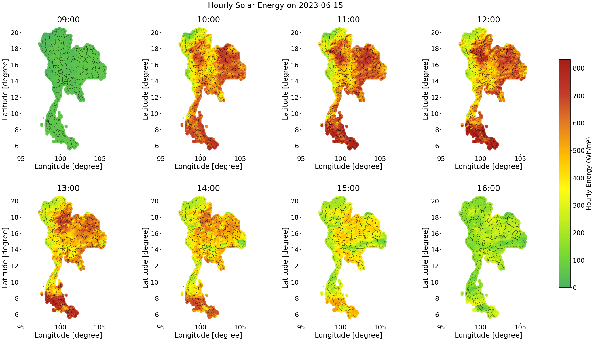
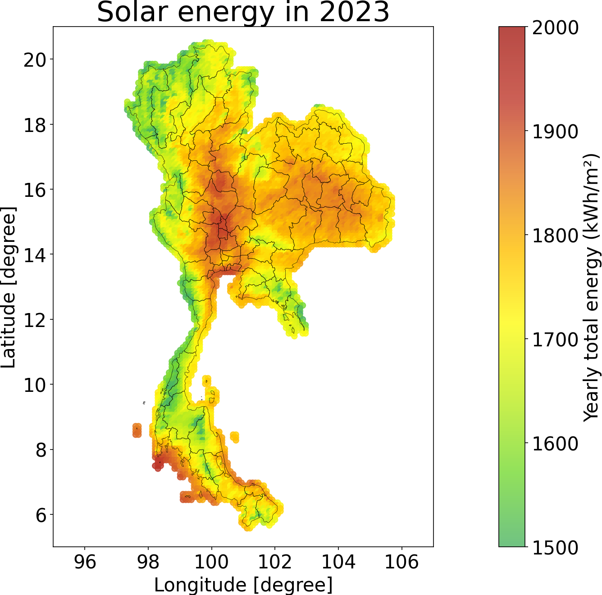

<p align="center">
  <h1 align="center">Developing a Thailand solar irradiance map using Himawari-8 satellite imageries and deep learning models</h1>
</p> 

 This paper presents an online platform showing Thailand solar irradiance map every 30 minutes available at https://www.cusolarforecast.com. The methodology for estimating global horizontal irradiance (GHI) across Thailand relies on cloud index extracted from Himawari-8 satellite imagery, Ineichen clear-sky model with locally-tuned Linke turbidity, and machine learning models. The methods take clear-sky irradiance, cloud index, re-analyzed GHI and temperature data from the MERRA-2 database, and date-time as inputs for GHI estimation models, including LightGBM, LSTM, Informer, and Transformer. These are benchmarked with the estimate from the SolCast service by evaluation of 15-minute ground GHI data from 53 ground stations over 1.5 years during 2022-2023. The results show that the four models have competitive performances and outperform the SolCast service. The best model is LightGBM with an MAE of 78.58 W/m^2 and RMSE of 118.97 W/m^2. Obtaining re-analyzed MERRA-2 data for the whole Thailand region is not economically feasible for deployment. When removing these features, the Informer model has a winning performance in MAE of 78.67 W/m^2. The obtained performance aligns with existing literature by taking the climate zone and time granularity of data into consideration. As the map shows an estimate of GHI over 93,000 grids with a frequent update, the paper also describes a computational framework for displaying the entire map. It tests the runtime performance of deep learning models in the GHI estimation process.

##

<table border="0">
 <tr>
    <td><p align="center"></p>
</td>
    <td><p align="center"></p>
</td>
 </tr> 
</table>


## Quick start

1. Install dependencies

```
conda create -n solarmap
conda activate solarmap
conda install pip
pip install torch torchvision torchaudio
```

for other packages, you can install from `requirements.txt`, i.e., `pip install -r requirements.txt`

2. Create a new path `dataset/preprocessed_data`. Then, download our preprocessed data from: [Google drive](https://drive.google.com/drive/folders/1vsWaPqMnBp1Whd2GhcbVOdFj4JofFQ-M?usp=sharing) and put the csv files into `dataset/preprocessed_data` folder.

### Shell script for DL

Run the scrip to train and test the neural network. 

Here, we prepare three shell script for each neural network, i.e., 

- `LSTM-CUEE_Train.sh` for LSTM
- `Informer-CUEE_Train.sh` for Informer
- `Formers-CUEE_Train.sh` for Transformer


```
./cuee_scripts/LSTM-CUEE_Train.sh
```

After training the model, you can perform inference only by setting `is_training` to 0 in the shell script  

 
``` 
python -u run_longExp.py --is_training 0 ....
```
### Notebook demo for LightGBM

Alternatively, you may look at the notebook jupyter as the demo for LightGBM:

[LGBM_notebook.ipynb](LGBM_notebook.ipynb)


## Acknowledgement

We appreciate the following github repos for their valuable code base or datasets:
- https://github.com/cure-lab/LTSF-Linear
- https://github.com/zhouhaoyi/Informer2020

 